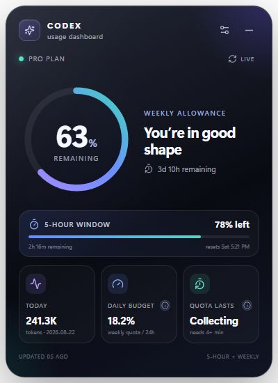

<div align="center">
  

  <h1>Codex Usage Dashboard Widget</h1>

  <p><strong>A polished Windows desktop widget for understanding your Codex usage at a glance.</strong></p>

  <p>
    
    
    
    
  </p>
</div>

<p align="center">
  
</p>

Codex Usage Dashboard keeps the limits that matter visible without making you interrupt your work to check them. It connects through the locally bundled Codex runtime, stays out of the taskbar, and can sit naturally on the desktop or hide in the system tray.

> [!NOTE]
> This is an independent community project. It is not an official OpenAI product and is not affiliated with or endorsed by OpenAI.

## Highlights

| Feature | What it gives you |
| --- | --- |
| **Weekly allowance** | Remaining weekly quota, reset countdown, and an at-a-glance status indicator. |
| **Five-hour window** | Remaining short-window quota and its rolling reset time whenever Codex returns that limit. |
| **Daily budget** | A suggested percentage of the total weekly quota to use per 24 hours, calculated from the exact quota and time remaining. |
| **Recent-rate projection** | An estimate of how long the binding quota may last based on percentage consumed during the latest 15-minute observation window. |
| **Daily activity** | Tokens used today when Codex provides daily token buckets. |
| **Desktop-native behavior** | System tray access, draggable placement, remembered position, optional desktop mode, and optional Windows startup. |
| **Personalization** | Adjustable transparency, curated background colors, and a custom color picker. |

## Install

1. Download the newest Windows installer from [GitHub Releases](https://github.com/w3bKodr/codex-dashboard-widget/releases/latest).
2. Run `Codex Usage Dashboard_*_x64-setup.exe`.
3. Choose whether the widget should start when you sign in to Windows.
4. Select **Connect with Codex** and finish the Codex-managed browser sign-in.

### Requirements

- Windows 10 or Windows 11 (64-bit)
- Microsoft Edge WebView2 Runtime, included with current Windows installations
- An active Codex-enabled account

The installer bundles the matching Codex runtime as an application resource, so users do not need to locate or separately install `codex.exe`.

## How the estimates work

### Daily budget

The daily budget divides the remaining weekly percentage across the exact time left until the weekly reset:

```text
daily budget = weekly percentage remaining / exact days until reset
```

The result is expressed as a percentage of the **total weekly allowance per 24 hours**, not a percentage of only the remaining allowance.

### Quota-lasts projection

The widget samples both the weekly and five-hour percentages locally. After at least four minutes of observations, it:

1. measures the total percentage consumed across a rolling window of up to 15 minutes;
2. includes idle time between Codex updates instead of counting only moments where the percentage changes;
3. projects each available allowance at that recent burn rate; and
4. shows whichever allowance would be exhausted first.

This is a short-term projection, not a guarantee. It deliberately changes as your coding intensity changes and shows **Idle** when no measurable recent usage exists.

## Privacy and security

- Sign-in is handled by the Codex-managed ChatGPT authorization page in your browser.
- The widget communicates with a local `codex app-server` child process.
- It does not read, copy, log, or persist your account tokens.
- Appearance preferences, window position, and anonymous percentage samples used for projections remain in the widget's local WebView storage.
- No analytics or third-party telemetry are included.

The packaged Codex runtime is sourced from the official `@openai/codex` package. Advanced users can test another Codex executable by setting `CODEX_WIDGET_CODEX_PATH` to its absolute path before launching the widget.

## Desktop behavior

- Drag the title bar to place the widget anywhere on the desktop.
- Use the minimize control to hide it to the Windows system tray.
- Click the tray icon to restore it.
- Enable **Desktop mode** to keep the widget behind ordinary application windows.
- Enable or disable **Start with Windows** at any time from Widget settings.
- Change panel transparency and background color without restarting.

The installer registers the installed application directly for startup. Do not copy the standalone executable into the Windows Startup folder; portable builds must remain beside their bundled `codex-runtime` directory.

## Development

### Prerequisites

- Node.js 20 or newer
- Rust stable with the MSVC Windows target
- Visual Studio Build Tools with the **Desktop development with C++** workload
- WebView2 Runtime

### Run locally

```powershell
git clone https://github.com/w3bKodr/codex-dashboard-widget.git
cd codex-dashboard-widget
npm install
npm run tauri:dev
```

The frontend-only preview is available with `npm run dev`. It uses representative sample data because native Codex IPC is available only inside Tauri.

### Verify and package

```powershell
npm run check
cargo test --manifest-path src-tauri\Cargo.toml
npm run tauri:build
```

The NSIS installer is written to:

```text
src-tauri/target/release/bundle/nsis/
```

### Project layout

```text
src/                    React interface, settings, and local projections
src-tauri/src/          Tauri host, Codex app-server client, and tray behavior
src-tauri/windows/      NSIS installer hooks
src-tauri/icons/        Generated platform icon set
assets/                 README artwork and screenshot assets
```

## Troubleshooting

### The widget opens but cannot connect to Codex

Install the latest release so the bundled runtime and dashboard stay in sync. For development builds, run `npm install` before `npm run tauri:dev`.

### The quota projection says “Collecting”

Keep the widget running for at least four minutes. The estimate requires multiple percentage samples from the same active allowance window.

### The quota projection says “Idle”

No measurable allowance change was detected during the recent observation window. Start using Codex and the projection will appear after the next percentage updates.

### The widget is not visible

Look for the dashboard icon in the Windows notification area and click it to restore the window. If Desktop mode is enabled, the widget may be behind other windows.

## Contributing

Issues and pull requests are welcome. For substantial changes, open an issue first so the behavior and UX can be discussed before implementation.

When contributing:

1. keep account credentials and tokens out of logs, fixtures, and screenshots;
2. preserve the duration-based allowance classification rather than assuming API bucket order;
3. run the TypeScript checks and Rust tests; and
4. include before-and-after screenshots for visible UI changes.

## Acknowledgements

Built with [Tauri](https://tauri.app/), [React](https://react.dev/), [TypeScript](https://www.typescriptlang.org/), [Lucide](https://lucide.dev/), and the [OpenAI Codex CLI](https://github.com/openai/codex).
